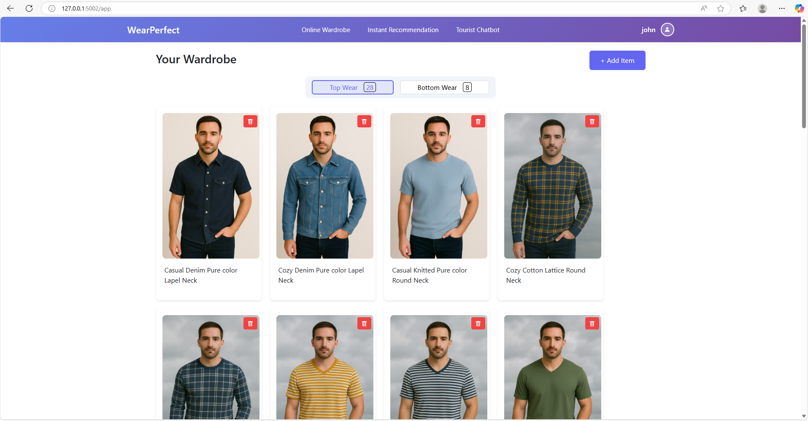
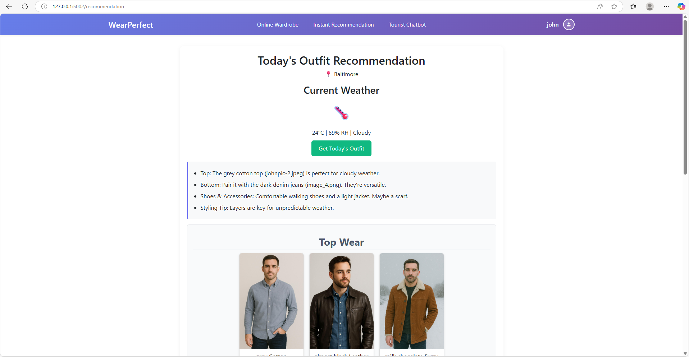
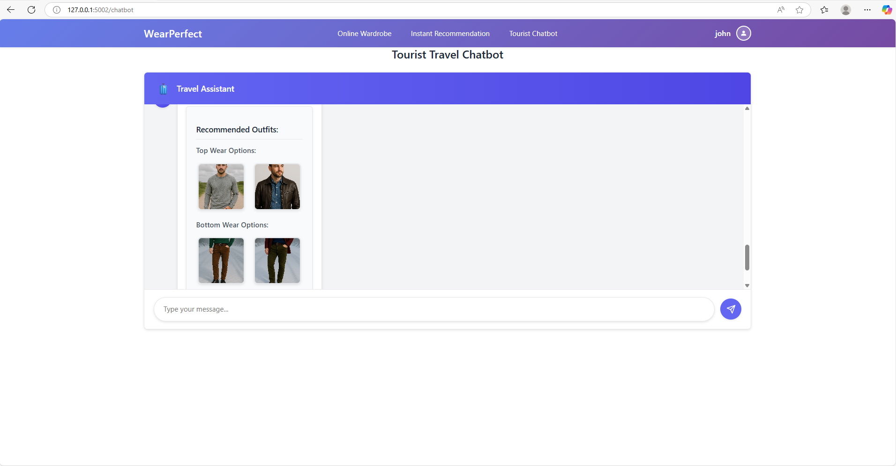

# WearPerfect: AI-Powered Weather-Based Outfit Recommendation System

## 🌟 Project Overview

WearPerfect is an AI-powered intelligent outfit recommendation system designed to enhance everyday clothing decisions through personalization and contextual awareness. The platform helps users select the most suitable outfits from their own wardrobe by taking into account real-time weather conditions, planned travel details, and social context (such as formal, casual, or party settings).

Users begin by uploading images of their clothing items, which the system processes using advanced Convolutional Neural Networks (CNNs) to extract visual features like sleeve length, lower clothing length, neckline, and more. These extracted features are then fed into a rule-based scoring mechanism that evaluates each item’s warmth, breathability, and occasion appropriateness using scientifically grounded metrics.

The combination of personal wardrobe data, weather intelligence, and context-aware scoring enables the system to deliver practical, tailored recommendations. Whether it's deciding what to wear today or packing smartly for an upcoming trip, WearPerfect acts as a virtual stylist, ensuring that users are both comfortable and stylish in any situation.

---

## 📋 Table of Contents

1. [Features](#features)
2. [Dataset and Assumptions](#dataset-and-assumptions)
3. [Demo Video](#demo)
4. [Comparison with Existing Systems](#comparison-with-existing-systems)
5. [Project Architecture](#project-architecture)
6. [Installation](#installation)
7. [Usage](#usage)
8. [Screenshots](#screenshots)
9. [Deployment](#deployment)
10. [Future Scope](#future-scope)
11. [Contributors](#contributors)
12. [License](#license)

---
## Features

### 🔐 User Authentication and Session Management
- Secure sign-in for personalized access  
- User-specific wardrobe storage  
- Tailored outfit recommendations  

### 🧠 CNN-based Attribute Extraction
- Automatically identifies visual features from uploaded images

### 🧮 Rule-Based Score Calculation
- Assigns scores based on scientific standards (e.g., **ISO 11092**):
  - **Warmth**
  - **Breathability**
- Enables explainable, transparent decision-making  

### 🌦️ Weather-Based Outfit Recommendations
- Uses real-time weather data  
- Employs a **K-Prototypes clustering model**  
- Suggests outfits based on conditions:
  - ☀️ Sunny  
  - 🌧️ Rainy  
  - ❄️ Snowy  
  - ☁️ Cloudy  

### 🤖 AI-Powered Travel Packing Chatbot
- Helps plan smart packing lists for trips  
- Adapts to:
  - Destination’s expected weather  
  - Trip Occasions (e.g., formal, party, Casual)  

### 💻 Interactive Web Application

### 👕 Virtual Wardrobe
- Upload and manage your clothing items  

### ⚡ Instant Recommendations
- Real-time outfit suggestions based on local weather  

### ✈️ Travel Packing Assistant
- Chatbot-style interface for multi-day travel planning  

---
## Dataset and Assumptions

We used the [**DeepFashion-MultiModal Dataset**](https://github.com/yumingj/DeepFashion-MultiModal), containing full-body clothing images. After preprocessing:

- Cropped into top wear and bottom wear separately.
- Removed irrelevant items (e.g., accessories, socks).

**Assumptions:**

- Users upload clean, front-facing clothing images.
- Scores (warmth, breathability) are based on ISO standards and thermal comfort literature.


---
## Demo 
🎥 [Watch the WearPerfect Demo on YouTube] : [Click Me](https://youtu.be/aux3F83rcfg)

---

## Comparison with Existing Systems

| Feature                        | Existing Systems       | WearPerfect                |
|-------------------------------|------------------------|----------------------------|
| Real-Time Weather              | ✅                     | ✅                         |
| Personalized Wardrobe         | ❌ Generic outfits     | ✅ Based on user uploads   |
| Occasion Awareness             | ❌                     | ✅ Casual/Formal/Party     |
| Travel Packing Assistant       | ❌                     | ✅ AI-powered chatbot       |
| Transparent Scoring            | ❌ Black-box           | ✅ Rule-based & Explainable|

> 🎯 WearPerfect bridges the gap between fashion intelligence and real-world utility.

---

## Project Architecture
<p align="center">
  
</p>
<p align="center"><i>This flowchart represents the end-to-end lifecycle from user wardrobe upload to real-time recommendations and travel packing assistance.</i></p>

---

## Installation

```bash
# Clone the repo
$ git clone https://github.com/RajaramAjay/WearPerfect.git
$ cd WearPerfect

# Create a virtual environment
$ python -m venv venv
$ source venv/bin/activate  # On Windows use: venv\Scripts\activate

# Install required packages
$ pip install -r requirements.txt

# Run the Application
$ python app.py
```

---

## Usage

1. Upload top and bottom wear clothing images.
2. System extracts attributes and calculates scores.
3. Choose "Instant Recommendation" or use the "Travel Chatbot."
4. Receive personalized outfit suggestions or travel packing list.

---

## Screenshots

<h3>Virtual Wardrobe Interface</h3>
<p align="center">
  
</p>
<h3>Real-time Recommendation Display</h3>
<p align="center">
  
</p>
<h3>Travel Chatbot Interaction</h3>
<p align="center">
  
</p>


---

## Deployment

* GitHub Repository ✅
* Future scope: Hosting on Streamlit or Hugging Face Spaces

---

## Future Scope

* Add virtual try-on using StableVITON or similar pretrained models.
* Expand scoring with color psychology and trend detection.
* Support multi-language and voice input features.
* Introduce feedback-based personalization.
* Extend forecast API beyond 14 days for improved travel planning.

---

## Limitations
## 🚧 Limitations

While **WearPerfect** demonstrates the potential of AI-assisted wardrobe planning, the current version has several limitations:

### ⏳ Limited Weather Forecast Horizon
- The OpenWeatherMap API only supports up to **14-day forecasts**
- Limits the accuracy of **long-term travel planning**

### 🧺 Prototype-Grade Virtual Wardrobe
- Current UI supports only **basic uploads and suggestions**
- Lacks advanced features:
  - Tagging
  - Bulk uploads

### 🖼️ No Real-Time Clothing Detection or Try-On (Yet)
- Users must upload **static images**  
- **Virtual try-on** with avatars or real-time fitting is a planned enhancement

### 📏 Fixed Scoring System
- Warmth, breathability, and occasion scores are **predefined**
- Not yet **adaptive** to:
  - User preferences  
  - Regional/climatic variations  
  - Fashion trends  

### 🧑‍🤝‍🧑 No Multi-User Wardrobe Sharing or Syncing
- Wardrobes are currently tied to **individual sessions**
- No support for:
  - **Cloud-based sync**
  - **Collaborative wardrobes** (e.g., family, stylist-client)

## Contributors

* Ajay Rajaram
* Sri Harsha Vardhan Madhiri
* Ashok Sai

---

## License

This project is licensed under the MIT License. See the [LICENSE](LICENSE) file for details.

---

## 📌 Acknowledgements

* DeepFashion Dataset
* ISO 11092 thermal resistance guidelines
* Hugging Face, OpenWeatherMap APIs
* StableVITON for virtual try-on (future integration)

## 💡 Bonus Tip

If you like this project, consider starring ⭐ the repo or contributing via issues or PRs!
